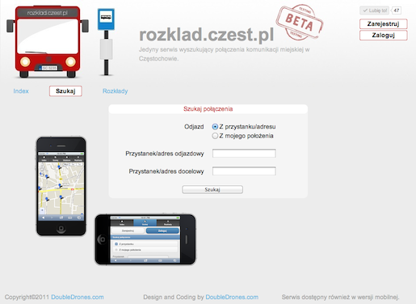
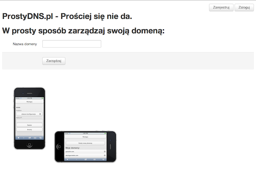

# HELLO!

## My name is Jakub Gorzelak (aka goozzik).

I am web developer using technologies like Ruby language and Rails framework.

I make web applications for mobile devices and desktop.

# PORTFOLIO

## [rozklad.czest.pl](http://rozklad.czest.pl)

Startup. Major developer. Service for searching public transport schedules.

## [prostydns.pl](http://prostydns.pl)

Easy domain registration and cofiguration. Site is still under development.

I am person who covers working between front-end and back-end.

